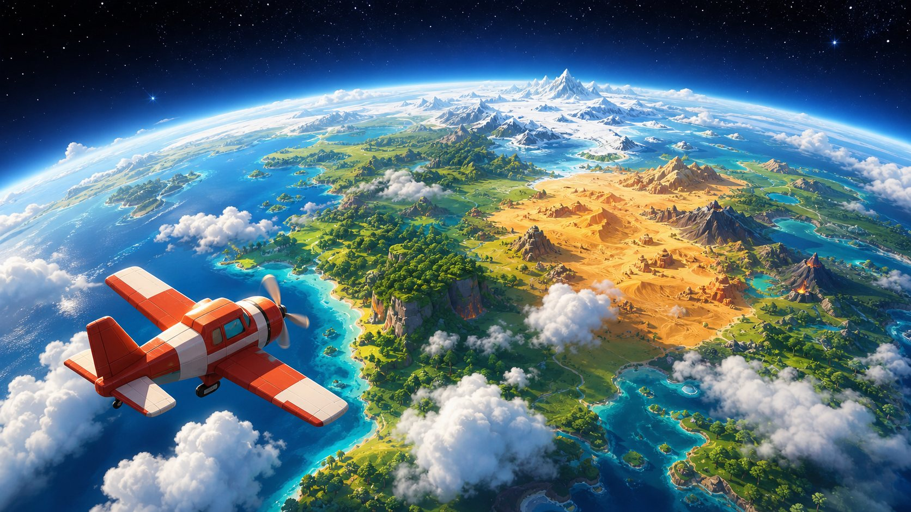

  

<h1 align="center">IGNITION</h1>

<b>Ein Universum aus Planeten — jeder baut seinen eigenen.</b>

  
  
  
  
  

---

**Ignition** ist ein Open-World-Erkundungsspiel mit prozeduralen Planeten in voller
Unreal-Engine-Grafik — und die Basis für eine **Portal-Welt**: ein offenes Universum,
in dem jeder seinen eigenen, selbst gehosteten Planeten andockt.

- 🌍 **Ein ganzer Planet ** — Kontinente, Gebirge, Küsten 
- 🐠 **Unterwasserwelt** — Korallenriffe, Seegras und frei schwimmende Fischschwärme
- 🌐 **Multiplayer** — dein Planet läuft auf deinem Servern
- 🌀 **Die Vision** — Portale verbinden selbst gehostete Planeten mit eigener Grafik
  und eigenem Gameplay zu einem Universum

## 💬 Community

Entwicklung live, Feedback, erste Testflüge:
**[→ Discord beitreten](https://discord.gg/EqtFCJGrSU)**

